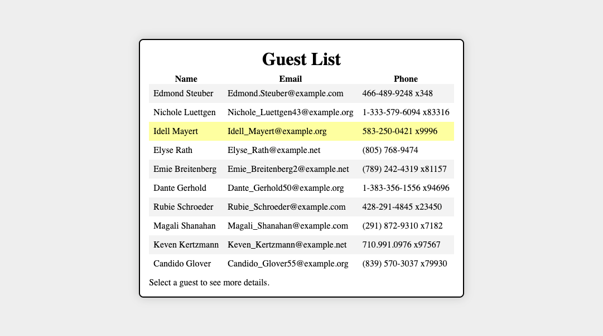

# Guest List

The [Fullstack Convention Center](https://fsa-crud-2aa9294fe819.herokuapp.com/api/) has contracted you for yet another web application.
This time, you'll build a site that allows users to view a list of guests. They can click
on a guest to learn more details about them.

Read the [API documentation](https://fsa-crud-2aa9294fe819.herokuapp.com/api/). You will
be working with the `/guests` endpoints.

## Instructions

You'll be starting from scratch! You are highly encouraged to reference previous
solutions. Your submission should meet the following requirements.

First, use placeholder data to build these features:

- The app initially renders a list of guests.
  This list should display at least the name and email of each guest.
- A user can click on a guest in the list to select the guest.
- If a guest is selected, the app renders details about the selected guest.
  This information should include the name, email, phone, bio, and job of the guest.
- If a guest is selected, a "back" button is rendered underneath the details. When
  clicked, this button will unselect the guest.
- If a guest is not selected, the app renders the list of guests.

Once your app is working with placeholder data, you can then continue on to fetching data
from the API.

- The app fetches the list of guests from the API.
- The app fetches details about the selected guest from the API.
- `useEffect` is used to isolate data-fetching logic.
- Data-fetching logic is extracted into a custom hook.

## Submission

Please submit the link to your public GitHub repository.
